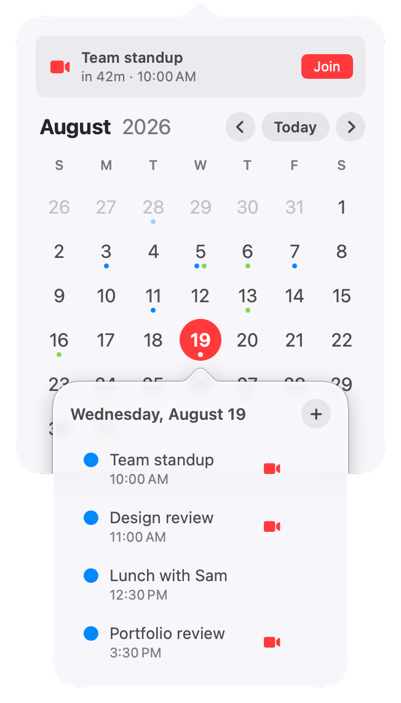
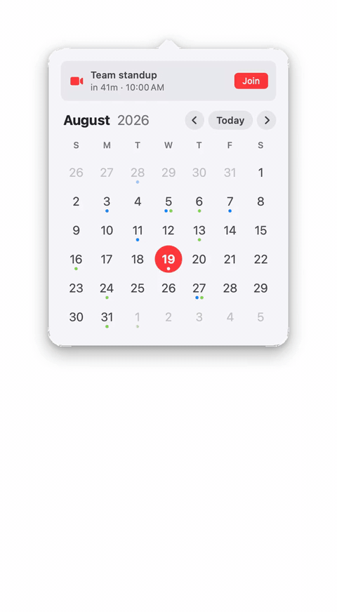
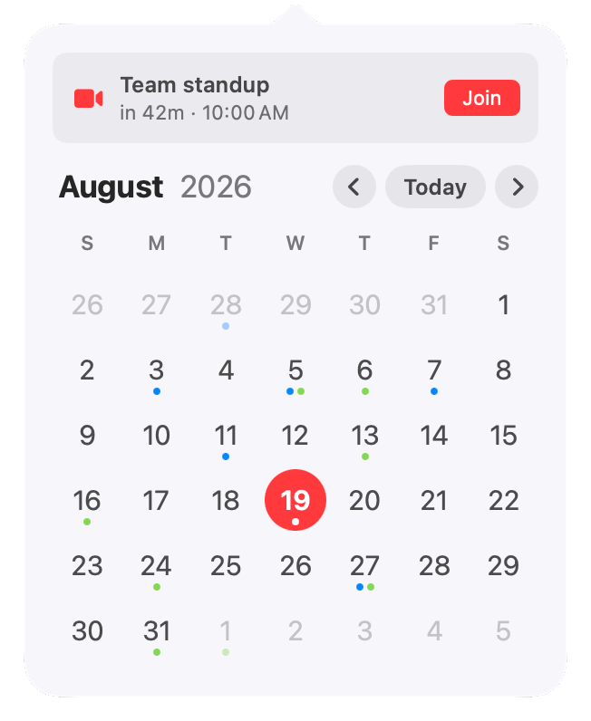
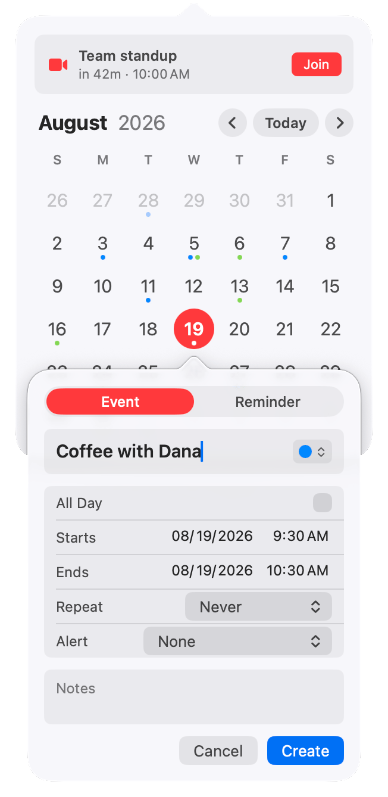
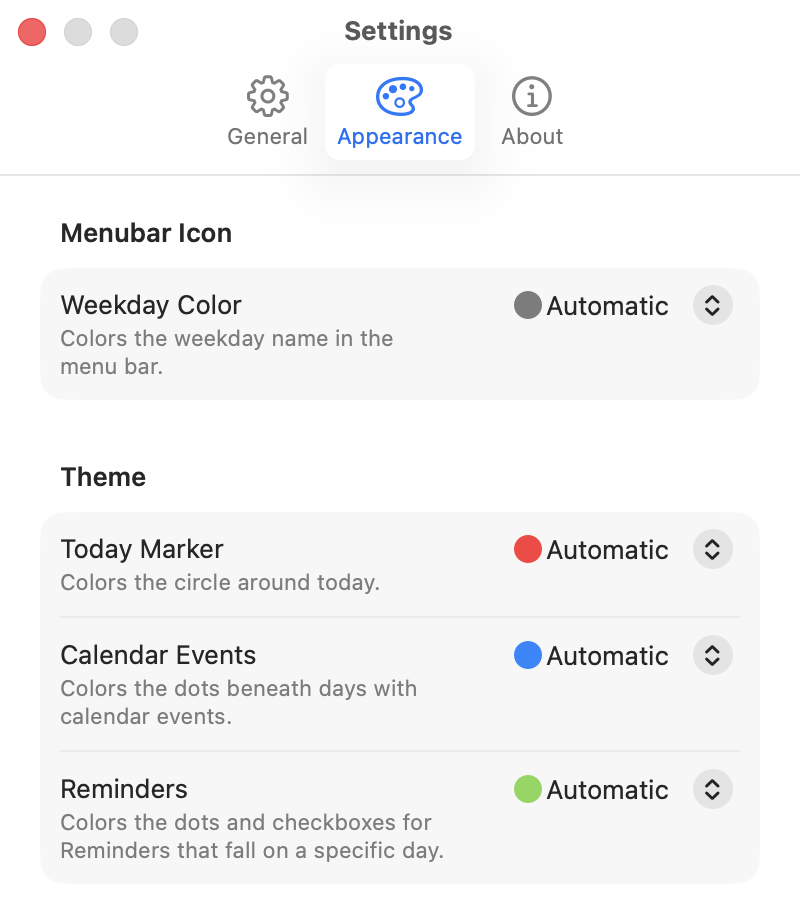
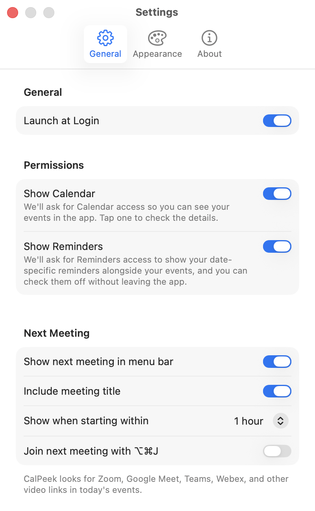

<h1 align="center">CalPeek</h1>

<table>
<tr>
<td width="55%" valign="middle">


<h1>Your calendar,<br>in the <em>menu bar</em>.</h1>

<p>Today's date always in sight. Your whole month one click away.</p>

<p><strong>CalPeek</strong> is a minimal, native macOS menu bar calendar. Glance
at the date in your menu bar, click it to peek at your month, your day, and
your next meeting. Free and open source.</p>

<p><a href="https://github.com/brianlg/CalPeek/releases/latest"><strong>Download for macOS</strong></a></p>

</td>
<td width="45%" valign="middle">

<picture>
<source media="(prefers-color-scheme: dark)" srcset="docs/images/day-dark.png">

</picture>

</td>
</tr>
</table>

## See it in action

<p align="center">
<picture>
<source media="(prefers-color-scheme: dark)" srcset="docs/images/demo-dark.gif">

</picture>
</p>

## Peek at any day

<picture>
<source media="(prefers-color-scheme: dark)" srcset="docs/images/day-dark.png">

</picture>

The menu bar glyph shows the weekday and the day of the month, and it stays
current as the date rolls over.

Click it for the month: event dots under every day, multi-day spans drawn
across, arrow keys to move by month or year, and one click back to today.

Click a day for its agenda. Calendar events and scheduled reminders appear
together, with times and calendar colors, and reminders check off without
leaving the popover.

<br clear="all">

## Never hunt for the meeting link

<picture>
<source media="(prefers-color-scheme: dark)" srcset="docs/images/join-dark.png">

</picture>

CalPeek finds the video link in your next meeting and puts a Join button at
the top of the popover. Zoom, Google Meet, Teams, Webex, and other links in
today's events are all recognized.

The countdown rides along in the menu bar so you can see the meeting coming,
and a global hotkey joins it without opening anything.

<br clear="all">

## Create in seconds

<picture>
<source media="(prefers-color-scheme: dark)" srcset="docs/images/create-dark.png">

</picture>

Pick a day, hit +, type. Events and reminders both, with times, repeat rules,
and alerts.

Everything writes straight back to Calendar and Reminders, so it shows up
wherever your calendar already syncs. Check a reminder off, and it is off
everywhere. No app switch, no second copy of your data.

<br clear="all">

## Make it yours

Pick the accent colors for the weekday name, today's marker, event dots, and
reminder dots. CalPeek follows light and dark mode and wallpaper-tinted menu
bars on its own.

<p align="center">
<picture>
<source media="(prefers-color-scheme: dark)" srcset="docs/images/appearance-dark.png">

</picture>
</p>

## Set it up once

<picture>
<source media="(prefers-color-scheme: dark)" srcset="docs/images/settings-dark.png">

</picture>

Launch at login, choose how far ahead the next meeting appears, and set the
join shortcut. That is the whole setup.

CalPeek reads your calendars and reminders on your Mac and sends nothing
anywhere. There is no account and no analytics. The only network call it
makes is the direct build checking for its own updates.

<br clear="all">

## Pricing

Free. No trial, no tiers, no in-app purchases, nothing held back. Download
it, use all of it, keep it forever.

## Install

Download the latest notarized build from
[Releases](https://github.com/brianlg/CalPeek/releases/latest), open the
`.dmg`, and drag CalPeek to your Applications folder. It updates itself via
[Sparkle](https://sparkle-project.org). CalPeek is also being submitted to the Mac App Store.

The `.zip` on the release page is what Sparkle downloads for updates. Use the
`.dmg` to install.

Requires macOS 14.6 or later.

## Building from source

You need Xcode 16+ and [XcodeGen](https://github.com/yonaskolb/XcodeGen):

```sh
brew install xcodegen
xcodegen generate
open CalPeek.xcodeproj
```

Then build and run the `CalPeek` scheme in Xcode.

Curious how the project is put together? Distribution channels, debug
builds, and the release process are documented in
[docs/DEVELOPMENT.md](docs/DEVELOPMENT.md).

## License

[MIT](LICENSE)
